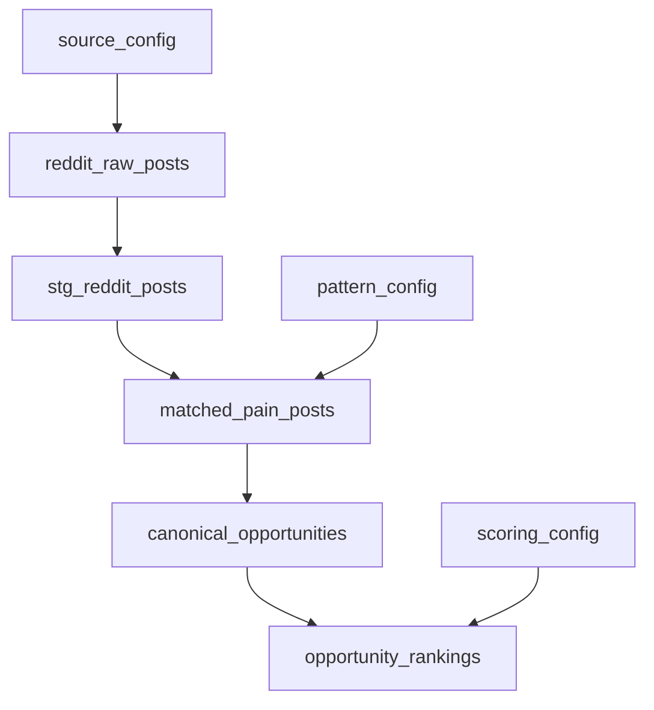

# ProblemPulse – System Design

## 1. Introduction

This document describes the technical architecture, dataflows, and operational model of ProblemPulse, an internal Reddit‑based opportunity intelligence platform.

ProblemPulse is implemented as a lean, single‑VPS system using a modern open‑source data stack (Airflow, PostgreSQL, dbt, Superset, Python ingestion) orchestrated with Docker Compose.

---

## 2. Requirements Summary

### 2.1 Functional (from PRD)

- Scheduled Reddit ingestion into Bronze tables.
- Cleaning, enrichment, and pain‑post selection into Silver/matched tables.
- Canonicalization/grouping into canonical opportunities.
- Scoring and ranking of opportunities with configurable weights.
- Superset dashboards for exploration and trends.
- Minimal alerting and backfill support.

### 2.2 Non‑Functional

- Single VPS deployment, no Kubernetes.
- Idempotent, re‑runnable pipelines.
- Basic security and secret management.
- Low operational overhead.

---

## 3. High‑Level Architecture

### 3.1 Component Overview

```mermaid
flowchart LR
  Reddit[[Reddit API]]

  subgraph Ingestion
    AF[Airflow\nScheduler & Workers]
    Worker[Python Ingestion\nService]
  end

  subgraph Storage["Storage (PostgreSQL)"]
    PG_B[(Bronze:\nreddit_raw_*)]
    PG_S[(Silver:\nstg_reddit_* &\nmatched_pain_posts)]
    PG_G[(Gold:\ncanonical_opportunities,\nopportunity_rankings)]
  end

  subgraph Processing["Modeling & Intelligence"]
    DBT[dbt Core\n(Staging & Aggregations)]
    ENRICH[Enrichment & Matching\n(Python/dbt)]
    CANON[Canonicalization & Grouping\n(Python batch)]
    SCORE[Scoring\n(db t/Python)]
  end

  subgraph Analytics["Analytics UI"]
    SUP[Apache Superset\n(Dashboards)]
  end

  Reddit --> AF --> Worker --> PG_B
  PG_B --> DBT --> PG_S
  PG_S --> ENRICH --> PG_S
  PG_S --> CANON --> PG_G
  PG_G --> SCORE --> PG_G
  PG_G --> SUP
```

**Key points:**

- Airflow orchestrates ingestion and processing.
- PostgreSQL holds all layers (Bronze, Silver, Gold).
- dbt handles deterministic SQL modeling; Python handles API integration, sentiment, and clustering.
- Superset is the primary UI for V1 (no separate microservices/API layer required).

---

## 4. Data Model & Flow

### 4.1 Layered Data Flow



- **Bronze:** `reddit_raw_posts`, `reddit_raw_comments`, `reddit_ingest_errors`.
- **Silver:** `stg_reddit_posts`, `stg_reddit_comments`, plus enriched fields.
- **Matched:** `matched_pain_posts` – subset of Silver that meets pattern/quality thresholds.
- **Gold:** `canonical_opportunities` (grouped themes) & `opportunity_rankings` (scores over time).

### 4.2 Core Tables

**Bronze**

- `reddit_raw_posts`
  - `id` (PK, Reddit post ID)
  - `subreddit`, `title`, `selftext`, `author`, `score`, `num_comments`, `created_utc`, `raw_json`, `ingested_at`

- `reddit_raw_comments` (optional for V1)

- `reddit_ingest_errors`
  - `id`, `source`, `payload`, `error_type`, `error_message`, `logged_at`

**Silver**

- `stg_reddit_posts`
  - cleaned fields + enrichment:
    - `is_deleted`, `language`, `is_question`, `matches_pain_pattern`, `engagement_score`, `sentiment_score`

- `stg_reddit_comments` (if used)

- `matched_pain_posts`
  - subset of `stg_reddit_posts` with `matches_pain_pattern = true` and quality filters.
  - includes `post_id`, `subreddit`, `created_utc`, `engagement_score`, `sentiment_score`, normalized text.

**Config**

- `source_config` – subreddits, query strings, polling parameters, enabled flags.
- `pattern_config` – text patterns for pain detection, min engagement thresholds.
- `scoring_config` – weights and thresholds for scoring, version identifiers.

**Gold**

- `canonical_opportunities`
  - `opportunity_id` (PK)
  - `canonical_title`
  - `representative_post_id`
  - `topic_keywords`
  - `first_seen_at`, `last_seen_at`
  - `segment` (optional user‑defined classification)

- `opportunity_rankings`
  - `opportunity_id`, `as_of_date`
  - `frequency_30d`, `avg_engagement`, `avg_sentiment`, `score`, `tier`
  - `scoring_version`, `config_version`

---

## 5. Pipeline Design

### 5.1 DAGs

#### DAG 1 – `reddit_ingest_daily` (Bronze)

- **Schedule:** daily (configurable).
- **Tasks:**
  1. `load_source_config`: read `source_config` from Postgres.
  2. `fetch_subreddit_{n}`: parallel Python tasks per source calling Reddit API.
  3. `persist_raw_posts`: upsert into `reddit_raw_posts`, `reddit_raw_comments`.
  4. `log_ingest_errors`: write malformed payloads to `reddit_ingest_errors`.

- **Behavior:**
  - Idempotent via `ON CONFLICT (id)` upserts.
  - Retries with exponential backoff on API/network errors.

#### DAG 2 – `reddit_modeling_and_scoring_daily` (Silver → Matched → Gold)

- **Schedule:** after ingestion DAG, daily.
- **Tasks:**
  1. `dbt_run_staging`: build `stg_reddit_*` models.
  2. `run_enrichment`: optional Python task to compute sentiment and update staging tables.
  3. `dbt_build_matched`: build `matched_pain_posts` using `pattern_config`.
  4. `canonicalize_opportunities`: Python batch job to cluster `matched_pain_posts` into `canonical_opportunities`.
  5. `compute_rankings`: dbt or Python job to produce `opportunity_rankings` using `scoring_config`.
  6. `health_check`: verify row counts and freshness; mark DAG as failed/warn if below thresholds.

---

## 6. Canonicalization & Scoring Design

### 6.1 Canonicalization Algorithm (V1)

- **Input:** `matched_pain_posts` for a defined horizon (e.g., last 90 days).
- **Steps (Python):**
  1. Normalize text (lowercase, strip URLs, stopwords).
  2. Compute TF‑IDF vectors for normalized texts.
  3. Perform clustering (e.g., threshold‑based similarity grouping):
     - Seed clusters with most frequent or highest‑engagement posts.
     - Assign other posts to nearest cluster if similarity > threshold; otherwise create new cluster.
  4. For each cluster:
     - Choose a representative post (e.g., highest engagement).
     - Derive `canonical_title` from that post.
     - Compute cluster‑level stats (first/last seen, frequency, keywords).
  5. Write or update `canonical_opportunities` and set `matched_pain_posts.opportunity_id`.

### 6.2 Scoring Function

- **Score components:**
  - `freq_score`: normalized frequency of posts mapped to an opportunity in the last N days.
  - `eng_score`: normalized average engagement.
  - `pain_score`: normalized pain intensity (from sentiment and frustration phrases).

- **Example formula:**

\[
score = w_f \cdot freq\_score + w_e \cdot eng\_score + w_p \cdot pain\_score
\]

where weights `w_f`, `w_e`, `w_p` come from `scoring_config`. The formula and weights are documented in dbt model docs for explainability.

---

## 7. Enrichment & NLP Design

- **Pattern detection:**
  - Implemented as SQL or Python regex based on `pattern_config` (e.g., “I wish there was”, “is there a tool that”, “I hate doing X manually”).

- **Question detection:**
  - Simple heuristic: title or body ends with `?` and includes question phrases.

- **Sentiment:**
  - Lexicon‑based sentiment analysis (e.g., VADER) run in Python; outputs `sentiment_score` per post.
  - No LLMs or external ML services used in V1 to keep cost and complexity low.

These features feed both `matches_pain_pattern` and the scoring model.

---

## 8. Alerting, Backfill, and Operations

### 8.1 Alerting

- Airflow configured with:
  - Email (SMTP) for DAG failure notifications.
  - Optional Slack webhook for critical failures.

**Alert triggers:**

- Any task failure in `reddit_ingest_daily` or `reddit_modeling_and_scoring_daily`.
- `health_check` task anomaly (e.g., daily ingested rows below threshold).

### 8.2 Backfill & Reprocessing

- **Bronze** (`reddit_raw_*`) is append‑only and treated as immutable aside from deduplication by ID.
- Silver/Gold are fully derived:
  - To reprocess history: run DAGs with date parameters (or dedicated backfill DAGs) that:
    - Rebuild staging and matched tables for the window.
    - Re‑run canonicalization and scoring.
  - Optionally truncate Silver/Gold partitions for the date range before rebuild to avoid double counting.

This supports evolving clustering/scoring logic without re‑pulling from Reddit.

### 8.3 Deployment Layout (Docker Compose)

- **Services:**
  - `airflow-scheduler`, `airflow-webserver`, `airflow-worker`.
  - `postgres` (analytics DB).
  - `superset`.
  - `ingestion-service` (Python).

- **Networking:**
  - Internal Docker network for Postgres/Airflow/Superset.
  - Superset and Airflow UIs accessible via HTTP, ideally behind VPN/SSH tunnel or IP allowlist.

---

## 9. Security & Secrets

- **Secrets management:**
  - Use `.env` files or Docker secrets mounted into containers for Reddit API keys, DB passwords.
  - Configure Airflow Connections through environment variables or UI, not committed to Git.

- **Access control:**
  - Protect Airflow and Superset with usernames/passwords.
  - Bind web UIs to a non‑public interface if possible (e.g., internal network, SSH tunnel).

- **Data handling:**
  - Reddit content is public, but usernames and raw JSON are still treated as internal.
  - No internal customer PII is ingested.

---

## 10. Evolution & Future Work

Potential future enhancements (beyond V1):

- Replace heuristic clustering with embedding‑based similarity and more robust topic modeling.
- Add competition signals (links to commercial products, mentions of existing tools).
- Introduce a small FastAPI/Next.js UI for better opportunity notes, bookmarks, and team workflows.
- Add Great Expectations for more advanced data quality flows if/when the pipeline or team grows.

For V1, the system remains deliberately lean: **one machine, one data warehouse, clear layers, and a minimal but real intelligence layer that produces canonicalized, ranked opportunities from Reddit data.**